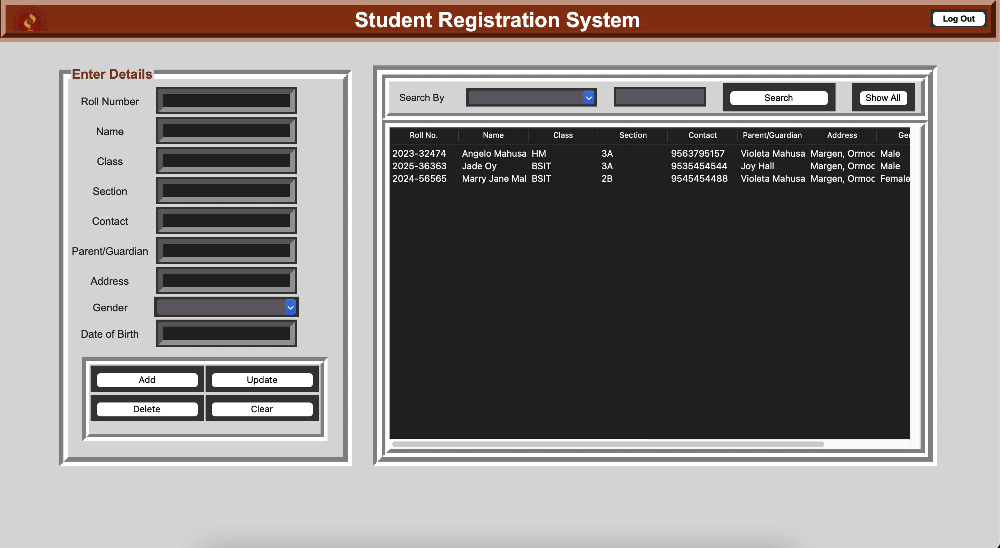

# Student Registration System



## Overview
This project implements a **Student Registration System** using Python, Tkinter for the GUI, and MySQL as the database backend.  
The system enables:  
- **Student Registration:** Add new student details.  
- **Search Functionality:** Find student records using various criteria.  
- **Error Handling:** Display user-friendly error messages for invalid inputs.  

### Design Origin
The initial design was inspired by a YouTube tutorial by [Shashank Saxena](https://www.youtube.com). Significant improvements and additional features have been implemented to enhance functionality and user experience.

---

## Technologies Used
- **Python**: Core programming language for the application.  
- **Tkinter**: GUI framework for creating the user interface.  
- **MySQL**: Database system for storing and managing student records.  

---

## Features
1. **Student Registration**  
   - Register new students with details like:  
     - Roll Number  
     - Name  
     - Class  
     - Section  
     - Contact Information  
     - Father’s Name  
     - Address  
     - Gender  
     - Date of Birth  

2. **Search Functionality**  
   - Search for student records based on:  
     - Roll Number  
     - Name  
     - Class  
   - Includes input validation and user-friendly error messages for invalid queries.  

3. **Error Handling**  
   - Enhanced error handling for:  
     - Invalid input data.  
     - Failed queries or database errors.  

---

## Credits
- **Original Design**: Inspired by [Shashank Saxena's](https://www.youtube.com) YouTube tutorial.  
- **Backend Implementation**: Developed and improved by **Me**.

---

## Installation

1. **Clone the repository**:  
   ```bash
   git clone https://github.com/angelomahusay/student-registration-system.git
   cd student-registration-system
